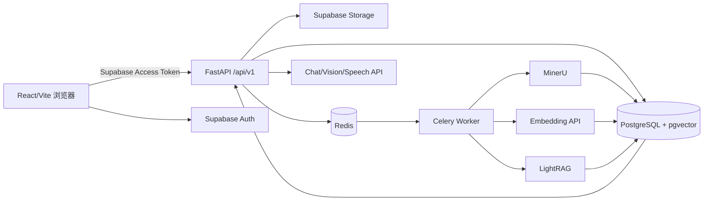
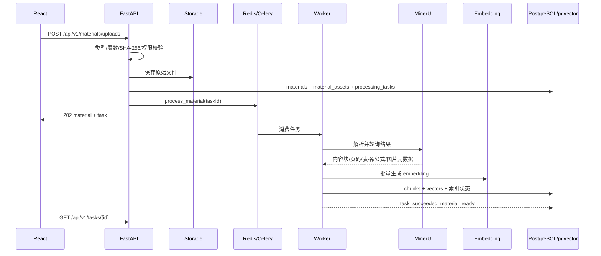
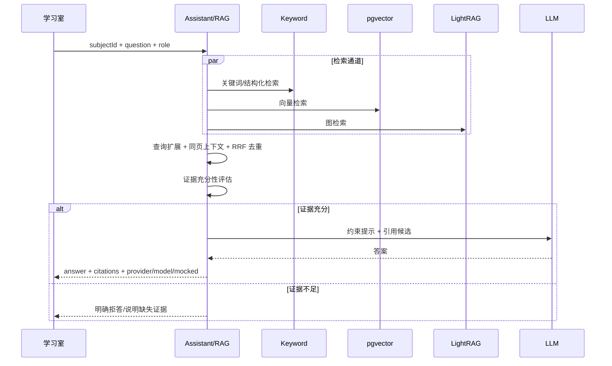
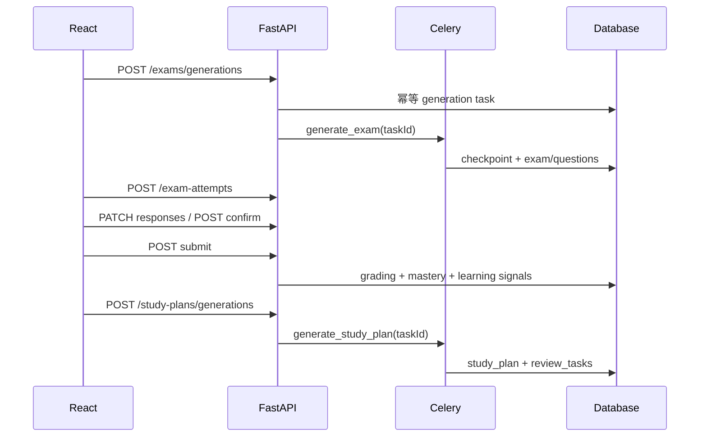

# Exam AI Assistant 项目技术面试指南

更新日期：2026-08-24

> 数字口径：本文只引用本轮实际运行的自动化测试、构建、OpenAPI 与静态扫描结果。真实服务 E2E、性能、Token 与成本尚未执行，统一标为 N/A，不能把单元测试结果表述为真实生产验收。

## 1. 项目背景与业务价值

这是一个按学科隔离的 AI 学习工作台，服务于期末复习场景。学生上传课程资料后，系统完成解析、切片、向量化与索引，再将有引用的问答、教学对话、学习产物、练习考试、评分信号和复习计划串成闭环。

业务价值不只是“让模型回答问题”，而是让每一步都可追溯：回答来自哪份资料和哪一页、考试依据了哪些证据、评分如何改变掌握度、计划为什么优先安排某个知识点。原“错题本”公开功能已经移除，用户说“查看错题”时转为“分析练习表现”，底层历史表暂时保留用于兼容与隐私处理。

## 2. 系统架构

当前代码规模证据：清理后后端应用 103 个 Python 文件、32 个后端测试文件、25 个前端 TS/TSX 文件、26 个 SQL migration；OpenAPI 为 62 paths / 75 operations。

## 3. 核心时序

### 3.1 资料异步处理

### 3.2 混合检索与引用问答

### 3.3 异步考试、评分与计划闭环

## 4. 技术选型与替代方案

| 选择 | 为什么适合 | 可替代方案与权衡 |
| --- | --- | --- |
| FastAPI + Pydantic | 异步接口、依赖注入、OpenAPI 与强校验适合 AI 服务编排 | Django REST 更完整但更重；NestJS 可统一 TS 技术栈 |
| React + Vite + TypeScript | 交互式工作台、构建快、类型门禁清晰 | Next.js 适合 SSR，但本项目认证后工作台的 SSR 收益有限 |
| Supabase Auth/Storage/Postgres | Auth、RLS、对象存储与 SQL 数据模型一体化 | 自建 Keycloak + S3 + Postgres 控制更强但运维成本更高 |
| pgvector | 与业务 SQL、RLS 和事务靠近，降低早期系统复杂度 | Milvus/Qdrant 更适合超大规模向量，但引入额外一致性与运维问题 |
| Celery + Redis | Python 生态成熟，支持重试、独立 Worker 和长任务 | Dramatiq/RQ 更轻；Kafka 适合高吞吐事件流但复杂度更高 |
| MinerU 主解析 + 本地降级 | 面向 PDF 的表格、公式、图片和结构信息更完整 | 纯 PyMuPDF 快但结构质量有限；云 OCR 可用性/成本需另评估 |
| LightRAG + keyword + vector | 图关系、精确词匹配与语义召回互补 | 单向量方案简单，但页码、术语和结构查询召回可能较弱 |

## 5. RAG、混合检索与引用机制

检索不是只做一次向量相似度。服务层组合关键词、pgvector 与 LightRAG，支持查询扩展和同页上下文，再用 RRF 合并排名并按 chunk 身份去重。引用对象保留资料名、页码、内容块、来源类型与分数，生成前先做证据充分性检查，生成后返回 `provider`、`model`、`mocked`、`grounded`、引用数和检索来源。

关键边界是 `user_id + subject_id`：API 先从认证上下文得到用户，再把学科约束传播到检索；数据库侧由 RLS 作为第二层保护。LightRAG 是增强通道而非 ready 的单点条件，失败时仍应保留关键词与 pgvector 可用性。

## 6. MinerU、pgvector 与 LightRAG

MinerU 负责主解析，产出内容块、页码、结构数据、边界框等；本地解析器用于完整性门禁或降级。切片保持 `content_block_id` 和页码，Embedding 写入 pgvector，LightRAG 建立额外图索引。任务元数据记录阶段，材料状态从 queued/running 走到 ready/failed；Worker 在重复投递或重启时通过任务终态、checkpoint 和幂等逻辑避免重复副作用。

本轮没有调用真实 MinerU、Embedding 或 LightRAG，Provider 成功率和耗时为 N/A。

## 7. Celery 异步任务与故障恢复

资料、考试和计划生成都以 `processing_tasks` 为持久状态。考试与计划曾同时提供同步和异步 HTTP 入口，本轮删除同步公开入口。两个 generation service 原本重复实现指纹、活跃任务查询和任务创建，现在抽取为一个公共 service：

1. Pydantic payload 用 alias 规范化。
2. JSON 按 key 排序并紧凑序列化。
3. SHA-256 截取 24 个十六进制字符作为请求指纹。
4. 同一用户、学科、任务类型和指纹若已有 queued/running 任务则复用。
5. 新任务携带 request、currentStage 和结果 ID 槽位；Worker 持续更新状态和 checkpoint。

这样解决的是“活跃重复请求”幂等；随机后缀允许历史终态之后重新生成，不会永久复用旧结果。

## 8. 确定性复习排程与 AI 增强

排程核心应保持确定性：目标日期、每日容量、周末增量、最后一天复盘、高优先级先排、间隔复现，以及已完成/人工调整任务保护，都不应交给 LLM 随机决定。AI 更适合补充任务文案、学习建议和解释。`needScore` 汇总掌握度缺口、练习损失、遗忘、对话困惑、重要性和数据置信度，并返回原因组件，便于前端解释“为什么安排”。

## 9. 数据库设计、RLS 与用户隔离

主要实体包括：subjects、materials/material_assets、content_blocks/material_chunks、processing_tasks、chat/memory、artifacts、exam_blueprints/questions/exams/attempts/responses/grading_results、study_plans/review_tasks、mastery 与 operation metrics。业务表普遍携带 `user_id` 和 `subject_id`；外键负责生命周期，RLS 负责数据库级租户边界，service 查询仍显式带用户条件，形成纵深防御。

`wrong_answers` 历史表暂时保留，但公开错题本路由和页面已删除；隐私导出与删除仍覆盖这张表。

## 10. API 设计与本轮收敛

API 使用唯一 `/api/v1` 前缀，`/health` 例外。清理前 OpenAPI 有 147 paths / 177 operations；清理后为 62 paths / 75 operations，删除 85 paths、增加 0 paths。删除构成为 68 条无前缀镜像、10 条 Workbench Mock 和 7 条重复/同步旧入口。

考试作答统一为 `/exam-attempts/*`；outline 归入 `/artifacts/outlines`；quiz 归入异步 exams；考试与计划只公开 `/generations`。详细矩阵见 `docs/acceptance/API_ACCEPTANCE_MATRIX.md`。

## 11. 性能与成本实测

本轮只有构建与测试门禁，不是性能验收：

- 清理前后端完整测试：170 passed，15.47s。
- 清理后后端完整测试：170 passed，17.50s。
- 清理前前端生产 build：7.46s；最大 chunk 509.75 kB，gzip 150.70 kB。
- 清理后前端生产 build：6.27s；最大 chunk 509.37 kB，gzip 150.58 kB，仍有大 chunk 警告。
- API p50/p95/max、队列等待、MinerU/Embedding/检索/LLM 阶段耗时：N/A。
- 输入/输出 Token、模型与外部服务成本、单场景和整轮成本：N/A。

这些 N/A 不能解释为 0，只表示本轮范围未执行真实链路。

## 12. 安全与隐私

- 浏览器只使用 Supabase URL 与 anon key；service role key 只允许后端环境变量。
- 所有工作台路由需要认证，Workbench 无认证 Mock 已删除。
- FastAPI service 查询使用当前 `user_id`，Postgres 再用 RLS 限制。
- 文件上传包含类型、魔数、大小和 SHA-256 处理。
- 隐私 service 覆盖导出、数据删除和账户删除。
- 本轮没有用两个真实用户执行越权攻击测试，真实隔离结果为 N/A。

## 13. 测试与真实验收

本轮基线和清理后完整后端测试均为 170 passed；清理后相关回归 35 passed。前端 `tsc --noEmit` 通过；Knip 从 2 个未使用依赖和 11 个未使用导出降为 0；Ruff F 类为 0；jscpd 克隆从 19 降到 14，重复行率从 1.01% 降到 0.71%。

这只能证明自动化回归和静态契约。Supabase、Redis/Worker、MinerU、真实模型、SMTP、双用户与故障注入尚未在本轮执行，因此项目不能据此宣布完整真实验收通过。

## 14. 遇到的问题与解决过程

1. **路由数量异常膨胀**：同一个 router 被无前缀和 `/api/v1` 挂载两次。通过 OpenAPI before/after 精确量化并删除旧挂载。
2. **同一业务存在多套入口**：考试 attempts、outline/quiz、考试/计划同步生成容易让客户端和测试分叉。先用全仓调用搜索确认正式前端，再删除旧入口并添加负向 OpenAPI 测试。
3. **Workbench Mock 暴露在正式 app**：不是配置条件，而是无条件 include。直接删除 router、占位数据、测试与前端 Mock 分支。
4. **generation service 重复**：两份实现只有 task type、key 前缀和结果字段不同。抽取参数化公共 service，薄包装保持现有导入边界。
5. **静态工具误报**：Vulture 会把 FastAPI route、Pydantic 字段和 validator 当未使用。采用“工具产候选 + 调用方搜索 + 测试证明”，没有机械删除反射入口。
6. **旧 E2E 脚本仍调用无前缀/同步接口**：更新为 `/api/v1` 和异步考试/计划任务等待，但本轮未执行真实 E2E。

## 15. 当前限制与未来优化

- 完成真实服务 E2E、Golden Questions、跨用户/跨学科隔离与故障注入。
- 删除剩余同步 `/materials/upload` 前，先把处理链路测试下沉到 service 层。
- 由 OpenAPI 自动生成 TypeScript 类型，减少手写 snake_case/camelCase 兼容转换。
- 修复 509.75 kB 构建 chunk，按路由/重依赖进一步拆包。
- 给 Ruff 建立项目配置，区分 FastAPI 合理例外与真实规则债。
- 补齐阶段耗时、Token、模型价格和 N/A 语义的成本报告。

## 16. 面试问题与参考回答（40 题）

### 架构与边界

1. **为什么把系统按学科组织，而不是全局知识库？**  学科是检索、权限、缓存和学习信号的共同边界，能降低跨课程误引用，并让计划和掌握度具有明确上下文。
2. **FastAPI 在系统里承担什么职责？**  认证后的业务 API、Pydantic 校验、service 编排、任务入队、统一错误和 OpenAPI；长任务本身交给 Celery。
3. **为什么 `/health` 不加版本前缀？**  健康检查是部署基础设施契约，不属于业务版本；其余业务只保留 `/api/v1`。
4. **如何避免 controller 变成业务逻辑堆积？**  API 层只做参数、认证和编排，持久化与规则进入 service；Worker 调用同一 service，避免另写一套业务。
5. **为什么删除无前缀兼容路由？**  双挂载让 OpenAPI、监控、权限审计和客户端调用数量翻倍，且迁移永远无法结束；本轮确认正式调用方后一次性收敛。

### RAG 与资料处理

6. **为什么不能只用向量检索？**  专有名词、公式和精确页码常由关键词更可靠；向量适合语义召回，LightRAG补关系，RRF降低单通道偏差。
7. **RRF 的优势是什么？**  它按各通道名次而非不可比的原始分数融合，对不同检索器的分数尺度更稳健。
8. **怎样保证引用页码正确？**  解析阶段把页码绑定到 content block，切片继承 block/page 元数据，生成只允许引用检索候选 ID，最终再回填来源字段。
9. **资料不足时为什么要拒答？**  学习场景错误自信比无回答更危险；证据充分性应作为生成门禁，而不是靠提示词祈祷模型自律。
10. **LightRAG 失败为什么资料仍应可用？**  它是增强索引，ready 应由可工作的基础检索保障；关键词和 pgvector 能提供降级路径。
11. **MinerU 与本地解析如何分工？**  MinerU是结构化主路径，本地原生解析用于完整性检查和受控降级；Provider 字段必须真实反映使用路径。
12. **如何处理重复上传？**  文件字节计算 SHA-256，在用户/学科和存储元数据范围内检测重复，复用 ready 结果或现有活动任务。
13. **如何防止恶意文件？**  扩展名、声明 MIME、魔数、大小、解压边界和文本提示注入分别校验；对象存储使用私有 bucket 与签名 URL。

### 异步与幂等

14. **为什么考试和计划也要异步？**  它们包含检索、多批模型调用、校验和持久化，耗时与部分失败都不适合占用 HTTP 请求生命周期。
15. **本项目的 generation 指纹怎么计算？**  payload 按 alias dump，JSON 排序 key 并紧凑序列化，SHA-256 后取 24 位。
16. **为什么 idempotency key 里仍有 UUID？**  指纹用于复用活动任务；UUID 允许同一请求在历史终态后合法重新生成，避免永远返回旧结果。
17. **Worker 重启如何恢复？**  持久 task 记录 status/stage/metadata/checkpoint；Worker 只接管 active 状态并从 checkpoint 继续，终态重复投递直接退出。
18. **任务取消后 Worker 又返回怎么办？**  每个阶段回报前检查持久状态；取消是终态，迟到结果不得覆盖它。
19. **批次部分失败如何设计？**  checkpoint 记录成功批次，只重试失败批次，最终按明确策略进入 succeeded/failed/partial，而不是丢失已完成工作。

### 考试、评分与计划

20. **为什么逐题确认要幂等？**  浏览器重试和网络超时会重复请求；相同答案应返回同一评分，已确认后修改则返回 409，避免掌握度重复计数。
21. **主观题怎么评分？**  题目生成时固定 rubric 与分值，评分返回 earned/missing criteria、反馈和引用；总分不得超过 rubric 分值。
22. **怎样避免生成重复题？**  校验题型数量、规范化 stem 去重、近似相似度检测、citation 白名单和 blueprint 一致性。
23. **练习信号如何进入计划？**  评分写入掌握度与学习交互，计划计算 needScore 时结合正确率、尝试次数、提示、对话困惑和重要性。
24. **为什么排程核心不能完全交给 LLM？**  日期、容量、间隔和保护已完成任务是硬约束；确定性算法可测试、可解释、可重复，LLM只增强表述。
25. **1 天计划如何保留最后复盘？**  目标日仍作为 final review/mocking 容器，前置学习容量不足时必须给出降级说明，而不是越界排任务。

### 数据与安全

26. **RLS 和 service 条件是否重复？**  是有意的纵深防御：service 避免业务错误与不必要扫描，RLS防止遗漏条件导致越权。
27. **如何验证用户 A 不能访问用户 B？**  用两个真实 Supabase 用户创建资源，逐类猜测 UUID；期望 404/403 且列表、导出、缓存均无泄漏。该真实测试本轮为 N/A。
28. **service role key 为什么危险？**  它可绕过 RLS；只能在后端环境使用，不得以 `VITE_*` 暴露到 bundle 或日志。
29. **账户删除应包含什么？**  Auth 身份、数据库行、Storage 对象、缓存、任务和派生索引；操作应可审计并明确终态。
30. **为什么历史 `wrong_answers` 表仍保留？**  数据迁移和隐私删除仍需兼容，但产品不再公开错题本入口；后续应在有迁移/保留策略后再删表。

### API、测试与质量

31. **如何证明接口真的收敛？**  保存 before/after OpenAPI，统计 path/operation，并添加负向契约测试保证旧路径不再出现。
32. **为什么不能直接相信 Vulture？**  FastAPI decorators 和 Pydantic 反射会让静态引用分析误报；必须结合框架语义、全仓调用搜索和回归测试。
33. **本轮代码质量改善如何量化？**  Knip 从 2 依赖+11 导出降为 0，Ruff F 为 0，jscpd 克隆 19→14、重复行率 1.01%→0.71%。
34. **为什么测试数量清理前后仍是 170？**  删除 3 个 Workbench 占位测试，同时增加路由负向契约和指纹测试等；数量巧合相同，关键是覆盖内容发生变化。
35. **前端类型与 OpenAPI 如何保持一致？**  当前靠 TypeScript lint、适配函数和 API 矩阵；更好的下一步是 CI 中从 OpenAPI 生成类型并做 diff 门禁。
36. **为什么 build 通过仍要关注 chunk warning？**  正确性门禁不等于性能；509.75 kB chunk 可能影响初始加载，需要 bundle 分析和按路由拆分。
37. **Mock 测试通过能否算真实验收？**  不能。必须确认环境开关、真实 Provider、真实 PDF、真实数据库/队列/邮件，并记录 `mocked=false` 和外部证据。
38. **成本不知道时为什么写 N/A 而不是 0？**  0 表示已测且免费，N/A 表示未采集；混淆会导致错误预算决策和虚假的面试数据。
39. **完整回归与只重跑失败测试有什么区别？**  修复可能影响未失败模块；完成标准要求修复后全量回归，局部测试只用于快速反馈。
40. **如果再做一轮，优先级是什么？**  先真实双用户安全和资料主链路，再 Golden Questions 质量、异常恢复、观测/成本，最后 bundle 和剩余低风险重复。

## 17. 现场演示流程

演示前必须确认真实环境，不得自动切换 Mock。建议顺序：

1. 展示 `.env` 的四个关键开关（只显示布尔值，不显示密钥）。
2. 注册并从 Mailpit/SMTP 完成邮箱验证，登录后展示 `/auth/me`。
3. 创建学科 A，上传仓库真实 PDF，展示 Storage 对象、task 进度、MinerU Provider 和 ready。
4. 提问一个带页码答案的问题，展开 provider/model/mocked/citations/retrieval sources。
5. 切换教学角色并进行一次追问与提示。
6. 生成思维导图或闪卡，点击引用回到资料。
7. 异步生成专项练习，逐题确认、提交评分，展示学习信号变化。
8. 异步生成 7 天计划，解释 needScore、容量、间隔和最后复盘。
9. 切换到用户 B，尝试访问用户 A 的 UUID，证明隔离。
10. 展示 `openapi-before/after`、API 矩阵、170 tests、lint/build 与扫描对比。

真实服务未准备好时，应停止在第 1 步并明确说明“本次演示环境无效”，不能改用 Workbench Mock；该 Mock 路由已从正式应用删除。
