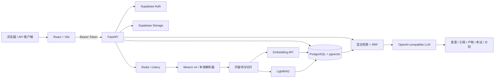

# Exam AI Assistant

> 面向期末复习的多模态 AI 学习助手：上传课程资料，经过结构化解析、混合检索和引用约束问答，进一步生成提纲、闪卡、模拟考试、错题复盘与自适应复习计划。

[](https://www.python.org/)
[](https://fastapi.tiangolo.com/)
[](https://react.dev/)
[](https://www.typescriptlang.org/)

## 项目状态

后端核心链路已经完成自动化与真实端到端验收：资料上传、异步处理、MinerU/本地解析、Embedding、pgvector、LightRAG、混合检索、引用问答、记忆、学习产物、考试、错题和复习计划均有对应服务或测试。

前端当前是可运行的学习工作台，但需注意：

- `VITE_MOCK_APP=true` 时，页面使用 `/api/workbench` 演示数据，不需要登录或外部 API。
- `VITE_MOCK_APP=false` 时，资料列表、上传和任务进度使用真实 `/api/v1` 接口。
- 其余部分页面仍连接 Workbench 演示接口；第一方 Supabase 登录/注册页面尚未接入。
- 真实接口要求 Supabase Bearer Token；当前前端会从浏览器 `localStorage` 读取已有 Supabase 会话。

## 核心能力

- **多格式资料接入**：PDF、TXT、DOC/DOCX、PPT/PPTX、XLS/XLSX、PNG/JPEG/WEBP/GIF/BMP/JP2、MP3/WAV/M4A。
- **结构化解析**：文本、标题、表格、图片、公式、页码、边界框和音频时间戳统一为内容块。
- **可靠解析策略**：MinerU v4 精准解析为主，原生文本完整性检查与本地解析为兜底。
- **混合检索**：LightRAG、pgvector 向量检索、PostgreSQL 全文/结构化检索与 RRF 融合。
- **引用约束问答**：答案携带资料、页码、块类型、时间范围等可追溯引用；资料不足时明确拒答。
- **教学与记忆**：多种教学角色、会话冻结快照、核心记忆写入审批、学习画像与技能沉淀。
- **学习产物**：提纲、思维导图、闪卡、公式表、术语表、对比表与速查表。
- **考试闭环**：多题型试卷、作答、评分、错题诊断、变式题、掌握度趋势与复习计划。
- **安全与隔离**：Supabase Auth、JWT、RLS、用户/学科隔离、文件魔数校验、提示注入扫描和隐私导出/删除。

## 系统架构



### 资料到答案的完整流程

1. 客户端使用 Supabase JWT 调用 `POST /api/v1/materials/uploads`。
2. 后端校验用户、配额、文件类型、文件内容魔数和 SHA-256，并写入私有 Storage。
3. Celery 创建或恢复解析任务，进度依次经过 `queued → parsing → embedding → indexing → ready`。
4. PDF/Office/图片优先交给 MinerU；TXT、音频及异常情况按配置走本地解析或转写兜底。
5. 解析结果写入 `content_blocks` 和 `material_chunks`，保留页码、表格、公式、图片和时间戳元数据。
6. 切片向量写入 pgvector，文档同时写入隔离的 LightRAG workspace。
7. 提问时并行执行 LightRAG、关键词/结构化检索和向量检索，再通过 RRF 合并去重。
8. LLM 只能依据检索上下文回答；响应返回答案、引用片段和消息 ID，并更新历史与复习进度。

## 技术栈

| 层级 | 技术 |
| --- | --- |
| 前端 | React 19、TypeScript、Vite、React Router、Zustand、Tailwind CSS、React Markdown |
| API | Python、FastAPI、Uvicorn、Pydantic、PyJWT、HTTPX |
| 异步任务 | Celery、Redis、Celery Beat |
| 数据与认证 | Supabase Auth、PostgreSQL、Row Level Security、Supabase Storage |
| 检索 | pgvector、LightRAG、PostgreSQL 全文/结构化检索、Reciprocal Rank Fusion |
| 文档处理 | MinerU v4、PyMuPDF、pypdf、python-docx、python-pptx、openpyxl、Pillow |
| 多模态 | OpenAI-compatible Chat / Embedding / Vision / Transcription API |
| 测试与运维 | pytest、FastAPI TestClient、Docker Compose、PowerShell 验收脚本 |

## 目录结构

```text
.
├─ backend/
│  ├─ app/
│  │  ├─ api/          # FastAPI 路由与请求模型
│  │  ├─ agents/       # 路由、规划、检索、生成与评估 Agent
│  │  ├─ config/       # 统一环境配置
│  │  ├─ db/           # Supabase 与向量存储适配
│  │  ├─ models/       # Pydantic 领域模型
│  │  ├─ prompts/      # UTF-8 Prompt 模板
│  │  ├─ services/     # 解析、检索、LLM、记忆、考试等业务服务
│  │  └─ worker/       # Celery Worker 与定时任务
│  ├─ migrations/      # 001～024 数据库迁移
│  ├─ scripts/         # 验收、质量评估、备份恢复脚本
│  ├─ tests/           # 后端自动化测试
│  └─ requirements.txt
├─ frontend/
│  ├─ src/             # React 页面、组件、状态与 API 客户端
│  ├─ package.json
│  └─ vite.config.ts
├─ scripts/            # Windows 本地服务脚本
├─ supabase-project/   # 官方自托管 Supabase Compose 配置
├─ experiments/        # MinerU A/B 实验与测试
├─ .env.example        # 唯一主配置模板
└─ start-project.ps1   # 前后端启动器
```

## 环境要求

推荐环境：

- Windows 10/11 + PowerShell 7；脚本也可按等价命令迁移到 Linux/macOS。
- Python 3.12+；当前验收环境为 Python 3.13。
- Node.js 20+ 与 npm 10+；当前验收环境为 Node.js 22。
- Docker Desktop / Docker Engine + Docker Compose v2，用于本地 Supabase、Redis 和 Worker。
- Git Bash、WSL 或其他带 `sh` 与 OpenSSL 的环境，用于首次生成自托管 Supabase 密钥。

## 外部服务与注册网址

演示模式不需要注册任何外部服务。完整或正式模式按下表准备：

| 服务 | 是否必需 | 用途 | 注册/管理地址 | 需要填写 |
| --- | --- | --- | --- | --- |
| 本地 Supabase | 完整本地链路必需 | Auth、PostgreSQL、Storage、RLS | 项目已内置，无需注册 | 由同步脚本写入 Supabase 相关变量 |
| Supabase Cloud | 可替代本地 Supabase | 托管数据库、认证与对象存储 | [Supabase Dashboard](https://supabase.com/dashboard) | `SUPABASE_*`、`DATABASE_URL` |
| SiliconFlow | 正式模型调用默认选择 | Chat、Embedding、Vision、Speech | [注册/登录](https://account.siliconflow.cn/)、[API Key](https://cloud.siliconflow.cn/account/ak) | `EXAMAI_OPENAI_API_KEY` |
| 其他 OpenAI-compatible 平台 | 可替代 SiliconFlow | 与上项相同 | 对应平台控制台 | Base URL、API Key、模型名 |
| MinerU | 正式文档解析建议配置 | PDF、Office、图片、表格和公式解析 | [MinerU 官网](https://mineru.net/)、[Token 管理](https://mineru.net/apiManage/token) | `MINERU_API_TOKEN` |
| 专业 Web Search API | 可选 | 外部知识补充 | 由部署方选择兼容服务 | `EXAMAI_WEB_SEARCH_URL`、`EXAMAI_WEB_SEARCH_API_KEY` |
| Wikipedia | 可选、无需注册 | 无专业搜索 API 时的公开知识兜底 | [Wikipedia](https://www.wikipedia.org/) | `ENABLE_WIKIPEDIA_FALLBACK=true` |

> `SUPABASE_SERVICE_ROLE_KEY`、数据库密码、模型密钥和 MinerU Token 都是服务端机密，禁止写入 `VITE_*`、前端源码、日志或版本库。

## 配置环境

所有应用进程统一读取仓库根目录的 `.env`。Vite 已设置 `envDir: '..'`，因此不要维护第二份真实前端配置。

```powershell
Copy-Item .env.example .env
```

### 运行模式

| 模式 | 关键配置 | 适用场景 |
| --- | --- | --- |
| 前端演示 | `VITE_MOCK_APP=true`、`MOCK_EXTERNAL_APIS=true` | 无账号快速查看页面与交互 |
| 本地完整链路 | `VITE_MOCK_APP=false`、本地 Supabase；可设 `CELERY_TASK_ALWAYS_EAGER=true` | 开发、接口联调和端到端验收 |
| 正式部署 | 两个 MOCK 开关均为 `false`，`CELERY_TASK_ALWAYS_EAGER=false` | Redis/Worker、真实模型、MinerU 与生产密钥 |

### 主要环境变量

#### 应用、认证与数据

| 变量 | 默认值 | 说明 |
| --- | --- | --- |
| `APP_ENV` | `development` | 环境名称 |
| `FRONTEND_ORIGIN` | `http://localhost:5173` | CORS 允许的前端 Origin |
| `VITE_API_BASE_URL` | `http://localhost:8000` | 浏览器访问的 FastAPI 地址 |
| `VITE_MOCK_APP` | `true` | 是否使用 Workbench 演示接口 |
| `SUPABASE_URL` | `http://localhost:18000` | Supabase API 地址 |
| `SUPABASE_ANON_KEY` | 空 | 注册、登录和匿名客户端密钥 |
| `SUPABASE_SERVICE_ROLE_KEY` | 空 | 后端管理密钥，仅服务端可见 |
| `SUPABASE_JWT_SECRET` | 空 | 后端验证 HS256 Access Token |
| `DATABASE_URL` | 本地 PostgreSQL 示例 | psycopg、pgvector 与 LightRAG 连接串 |
| `MATERIAL_STORAGE_BUCKET` | `study-materials` | 私有资料 bucket |

#### 模型与解析

| 变量 | 默认值 | 说明 |
| --- | --- | --- |
| `MOCK_EXTERNAL_APIS` | `true` | 使用确定性本地模型响应，测试环境建议开启 |
| `EXAMAI_MODEL_PROVIDER` | `openai_compatible` | 模型适配器 |
| `EXAMAI_OPENAI_BASE_URL` | `https://api.siliconflow.cn/v1` | OpenAI-compatible API 根地址 |
| `EXAMAI_OPENAI_API_KEY` | 空 | 模型平台 API Key |
| `EXAMAI_LLM_MODEL` | `deepseek-ai/DeepSeek-V4-Flash` | 对话/生成模型 |
| `EXAMAI_EMBEDDING_MODEL` | `Qwen/Qwen3-VL-Embedding-8B` | 向量模型 |
| `EXAMAI_VISION_MODEL` | `Qwen/Qwen2.5-VL-72B-Instruct` | 图片与视觉内容模型 |
| `EXAMAI_TRANSCRIPTION_MODEL` | `FunAudioLLM/SenseVoiceSmall` | 音频转写模型 |
| `ENABLE_MINERU` | `true` | 是否启用 MinerU 主解析链路 |
| `MINERU_API_TOKEN` | 空 | MinerU 精准解析 Token |
| `MINERU_BASE_URL` | `https://mineru.net` | MinerU 服务地址 |
| `MINERU_MODEL_VERSION` | `pipeline` | MinerU 模型版本 |
| `MINERU_TIMEOUT_SECONDS` | `900` | 单次解析总超时 |
| `MINERU_ENABLE_LOCAL_FALLBACK` | `true` | MinerU 失败时是否启用本地兜底 |
| `LIGHTRAG_WORKING_DIR` | `backend/data/lightrag` | LightRAG 本地状态目录；相对仓库根目录解析 |

#### 队列、开关与限制

| 变量 | 默认值 | 说明 |
| --- | --- | --- |
| `REDIS_URL` | `redis://localhost:6379/0` | Celery broker 与结果后端 |
| `CELERY_TASK_ALWAYS_EAGER` | `false` | `true` 时在 API 进程同步执行任务，仅用于本地验收 |
| `TASK_MAX_RETRIES` | `3` | 资料处理最大尝试次数 |
| `MAX_UPLOAD_MB` | `200` | 单文件上限 |
| `MAX_ACTIVE_TASKS_PER_USER` | `3` | 单用户并发任务限制 |
| `MAX_DAILY_UPLOAD_MB` | `1000` | 单用户每日上传总量限制 |
| `ORIGINAL_FILE_RETENTION_DAYS` | `90` | 原始文件保留天数 |
| `MODEL_CALL_BUDGET_USD` | `5.0` | 单用户模型调用预算控制 |
| `ENABLE_HERMES_MEMORY` | `true` | 是否启用记忆快照与整理 |
| `ENABLE_EXTERNAL_KNOWLEDGE` | `false` | 是否允许专业外部搜索 |
| `ENABLE_WIKIPEDIA_FALLBACK` | `true` | 是否允许 Wikipedia 兜底 |

其余阈值、成本和多模态参数均带注释列在 [`.env.example`](.env.example) 中。

## 快速开始

### 1. 安装依赖

```powershell
# 后端
Set-Location backend
python -m venv .venv
.\.venv\Scripts\python.exe -m pip install -r requirements.txt

# 前端
Set-Location ..\frontend
npm install
Set-Location ..
```

### 2A. 只看演示页面

根 `.env` 保持：

```dotenv
VITE_MOCK_APP=true
MOCK_EXTERNAL_APIS=true
```

随后直接执行：

```powershell
.\start-project.ps1
```

访问：

- 前端：<http://localhost:5173>
- FastAPI Swagger：<http://localhost:8000/docs>
- ReDoc：<http://localhost:8000/redoc>
- 健康检查：<http://localhost:8000/health>

### 2B. 启动完整本地 Supabase

首次使用需生成独立密钥，不能沿用示例值：

```powershell
Copy-Item supabase-project\.env.example supabase-project\.env
```

然后在 Git Bash 或 WSL 中执行：

```bash
cd supabase-project
sh utils/generate-keys.sh --update-env
```

回到 PowerShell：

```powershell
.\scripts\start-local-supabase.ps1
.\scripts\sync-local-supabase-env.ps1
```

本地地址：

- Supabase API / Studio：<http://localhost:18000>
- PostgreSQL Session Pooler：`localhost:5432`
- PostgreSQL Transaction Pooler：`localhost:6543`

应用迁移并验证数据库：

```powershell
Set-Location backend
.\.venv\Scripts\python.exe scripts\e2e_acceptance.py --apply-migrations
Set-Location ..
```

### 3. 异步任务运行方式

本地单进程调试可在 `.env` 设置：

```dotenv
CELERY_TASK_ALWAYS_EAGER=true
```

正式异步模式应设置为 `false`，并启动 Redis、Worker 和 Beat：

```powershell
Set-Location backend
docker compose -f docker-compose.worker.yml up -d redis worker beat
Set-Location ..
```

### 4. 启动和停止项目

```powershell
.\start-project.ps1            # 启动 FastAPI 与 Vite
.\start-project.ps1 -NoBrowser # 不自动打开浏览器
.\stop-project.ps1             # 停止启动器记录的进程
```

一键脚本：`一键启动.cmd`、`一键停止.cmd`。

> 启动器只负责 FastAPI 与 Vite，不会自动启动 Supabase、Redis 或 Celery Worker。

## API 使用

### 认证约定

- 推荐业务前缀：`/api/v1`。
- 除 `/health` 和 `/api/workbench/*` 外，业务接口都要求 `Authorization: Bearer <SUPABASE_ACCESS_TOKEN>`。
- 为兼容旧客户端，同一业务路由目前也挂载在无 `/api/v1` 前缀的路径；新代码不要依赖旧路径。
- Swagger 自动文档是接口模型的最终准确信息来源：<http://localhost:8000/docs>。

### 接口分组

| 模块 | 主要接口 | 说明 |
| --- | --- | --- |
| 健康与用户 | `GET /health`、`GET /api/v1/auth/me` | 服务状态与当前用户 |
| 学科 | `GET/POST /api/v1/subjects`、`GET/PATCH/DELETE /api/v1/subjects/{id}` | 学科 CRUD 与外部知识开关 |
| 资料 | `GET /api/v1/materials`、`POST /api/v1/materials/uploads`、`GET /api/v1/materials/{id}/blocks` | 异步上传、内容块、原始来源 |
| 任务 | `GET /api/v1/tasks/{id}`、`POST .../retry`、`DELETE .../{id}` | 查询、重试和取消资料处理 |
| 检索 | `POST /api/v1/retrieval/search` | LightRAG + 关键词 + 向量混合检索 |
| 问答 | `POST /api/v1/chat/ask`、`GET /api/v1/chat/history/{subjectId}` | 带引用问答与历史 |
| 教学助手 | `POST /api/v1/assistant/messages` | 意图路由、角色教学和工具编排 |
| 学习产物 | `/api/v1/artifacts`、`.../outlines`、`.../mind-maps`、`.../flashcards` | 生成、编辑、复习和导出 |
| 考试与错题 | `/api/v1/exams`、`/api/v1/exam-attempts`、`.../wrong-answers/...` | 组卷、作答、评分、错题与变式题 |
| 复习 | `/api/v1/review/...`、`/api/v1/study-plans/...` | 掌握度、趋势、今日任务和冲刺计划 |
| 记忆 | `/api/v1/memories`、`/api/v1/memory-writes/...`、`/api/v1/memory-snapshots` | 核心记忆、审批和冻结快照 |
| 学习画像 | `/api/v1/learner-profile`、`/api/v1/sessions/search`、`/api/v1/skills` | 画像、语义会话历史与技能管理 |
| 隐私与运维 | `/api/v1/privacy/...`、`GET /api/v1/operations/metrics` | 导出、删除、账户清理和指标 |
| 演示接口 | `/api/workbench/*` | 无认证的前端占位数据，不用于生产 |

### 输入与输出示例

以下 ID、Token 和内容均为示例。

#### 1. 创建学科

```http
POST /api/v1/subjects
Authorization: Bearer <ACCESS_TOKEN>
Content-Type: application/json

{
  "name": "线性代数",
  "description": "期末复习资料",
  "external_knowledge_enabled": false
}
```

```json
{
  "id": "7c512f5c-2e7f-4cd4-9c0c-7b25723915ce",
  "name": "线性代数",
  "description": "期末复习资料",
  "externalKnowledgeEnabled": false,
  "createdAt": "2026-08-02T10:00:00Z",
  "updatedAt": "2026-08-02T10:00:00Z"
}
```

#### 2. 异步上传资料

```bash
curl -X POST "http://localhost:8000/api/v1/materials/uploads" \
  -H "Authorization: Bearer <ACCESS_TOKEN>" \
  -F "subject_id=7c512f5c-2e7f-4cd4-9c0c-7b25723915ce" \
  -F "file=@./PDF资料/transformer的原理.pdf"
```

```json
{
  "material": {
    "id": "material-id",
    "subjectId": "7c512f5c-2e7f-4cd4-9c0c-7b25723915ce",
    "filename": "transformer的原理.pdf",
    "status": "queued"
  },
  "task": {
    "id": "task-id",
    "status": "queued",
    "stage": "queued",
    "progress": 0,
    "attempts": 0,
    "maxAttempts": 3
  },
  "deduplicated": false
}
```

轮询：

```http
GET /api/v1/tasks/task-id
Authorization: Bearer <ACCESS_TOKEN>
```

任务成功时 `status` 为 `succeeded`、`stage` 为 `ready`、`progress` 为 `100`。

#### 3. 混合检索

```http
POST /api/v1/retrieval/search
Authorization: Bearer <ACCESS_TOKEN>
Content-Type: application/json

{
  "subjectId": "7c512f5c-2e7f-4cd4-9c0c-7b25723915ce",
  "question": "矩阵可对角化的条件是什么？",
  "topK": 5,
  "blockTypes": ["text", "formula"]
}
```

```json
{
  "subjectId": "7c512f5c-2e7f-4cd4-9c0c-7b25723915ce",
  "question": "矩阵可对角化的条件是什么？",
  "workspace": "user_x_subject_y",
  "citations": [
    {
      "id": "block-id",
      "materialId": "material-id",
      "filename": "线性代数讲义.pdf",
      "chunkText": "n 阶矩阵可对角化当且仅当存在 n 个线性无关特征向量……",
      "pageNumber": 18,
      "blockType": "text",
      "retrievalSource": "keyword+vector"
    }
  ],
  "retrieval": {
    "mode": "hybrid",
    "sources": ["keyword", "vector"],
    "resultCount": 1,
    "warnings": []
  }
}
```

#### 4. 带引用问答

```http
POST /api/v1/chat/ask
Authorization: Bearer <ACCESS_TOKEN>
Content-Type: application/json

{
  "subjectId": "7c512f5c-2e7f-4cd4-9c0c-7b25723915ce",
  "question": "用考试答题的方式说明矩阵可对角化条件。",
  "sessionId": "review-session-001"
}
```

```json
{
  "answer": "矩阵可对角化的充要条件是它具有 n 个线性无关的特征向量……",
  "citations": [
    {
      "id": "block-id",
      "materialId": "material-id",
      "sourceName": "线性代数讲义.pdf",
      "text": "n 阶矩阵可对角化当且仅当……",
      "sourceType": "material",
      "pageNumber": 18,
      "retrievalSource": "keyword+vector"
    }
  ],
  "messageId": "message-id"
}
```

资料不足时返回固定语义：`资料中未找到足够依据。请先上传并索引相关资料，或换一个更具体的问题。`

#### 5. 生成模拟考试

```json
{
  "subjectId": "7c512f5c-2e7f-4cd4-9c0c-7b25723915ce",
  "title": "线性代数期末模拟",
  "durationMinutes": 90,
  "difficulty": "medium",
  "questionTypes": [
    {"questionType": "single_choice", "count": 10, "pointsEach": 3},
    {"questionType": "calculation", "count": 4, "pointsEach": 10}
  ],
  "externalRatio": 0,
  "avoidSeen": true,
  "assessmentType": "mock"
}
```

提交到 `POST /api/v1/exams`。完整字段和响应结构请在 Swagger 中查看。

## 测试与验收

```powershell
# 后端测试
Set-Location backend
.\.venv\Scripts\python.exe -m pytest tests -q -p no:cacheprovider

# 前端类型检查与生产构建
Set-Location ..\frontend
npm run lint
npm run build

# 本地 Supabase / Auth / Storage / JWT 验证
Set-Location ..\backend
.\.venv\Scripts\python.exe scripts\verify_local_supabase.py

# 真实端到端验收
.\.venv\Scripts\python.exe scripts\e2e_acceptance.py
```

端到端脚本覆盖：数据库 schema、用户注册、JWT、学科隔离、多格式上传、异步处理、检索引用、问答历史、复习进度、跨学科防串库和跨用户隔离。

更多运维命令见 [`backend/OPERATIONS.md`](backend/OPERATIONS.md) 与 [`backend/scripts/README.md`](backend/scripts/README.md)。

## 编码与注释规范

- `.editorconfig` 统一规定文本使用 **UTF-8、LF、文件末尾换行、移除行尾空格**。
- Markdown、Python、TypeScript、JSON、SQL、YAML 和 PowerShell 文件均应保存为 UTF-8；不要使用 ANSI/GBK 保存源码。
- 中文课程 TXT 输入支持 UTF-8、UTF-8 BOM、UTF-16、GB18030/GBK，并在无法可靠判断时明确失败。
- 注释用于解释“为什么”、边界条件、安全要求和兼容原因；避免重复描述显而易见的代码。
- 环境变量注释必须标明必填/可选、默认值影响和是否属于机密。
- 不要在注释、示例、测试输出或日志中写入真实 API Key、JWT、数据库密码、签名 URL 或用户资料。

## 安全与数据说明

- 用户业务数据按 `user_id` 隔离，数据库表启用 RLS；后端服务角色密钥仅用于可信服务端。
- 上传内容是不可信输入；系统执行类型/魔数校验、路径规范化和提示注入风险扫描。
- MinerU 启用时，上传的文档会发送到第三方解析服务；正式部署必须在隐私政策中明确说明。
- 原始资料默认保留 `ORIGINAL_FILE_RETENTION_DAYS` 天，Celery Beat 定期清理；用户可调用隐私 API 导出或删除数据。
- 前端构建使用的 React Router 当前存在仅影响 RSC/Server Action 模式的上游审计告警；本项目使用纯 BrowserRouter SPA，不启用受影响模式。上游发布稳定修复版后应及时升级并重新执行 `npm audit`。

## 设计参考

README 的信息组织参考了成熟开源项目常见结构：先说明项目价值和状态，再提供架构、快速开始、配置、接口示例、验收和安全边界。可进一步参考：

- [Dify](https://github.com/langgenius/dify)：AI/RAG 项目的功能概览、快速开始与部署分层。
- [FastAPI](https://github.com/fastapi/fastapi)：清晰的特性、安装、最小示例和自动 API 文档说明。
- [Supabase](https://github.com/supabase/supabase)：本地开发、托管服务和后端能力说明。
- [MinerU](https://github.com/opendatalab/MinerU)：多格式文档解析能力与运行方式。
